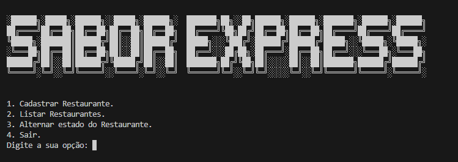

# Sabor Express

---

## Índice

- [Introdução](#introdução)
- [Instalação](#instalação)
- [Uso](#uso)
- [Funcionalidades](#funcionalidades)

---

## Introdução



Projeto desenvolvido durante o curso de [Python: crie a sua primeira aplicação](https://cursos.alura.com.br/course/python-crie-sua-primeira-aplicacao) da Alura.
O **Sabor Express** é uma aplicação de console desenvolvida em Python que permite o gerenciamento de restaurantes por meio de uma interface interativa. O sistema oferece funcionalidades como cadastro de novos restaurantes, listagem de restaurantes cadastrados e alteração do status de atividade.

---

## Instalação

Para configurar o projeto localmente, siga os passos abaixo:

1. Certifique-se de ter o **Python 3.12 ou superior** instalado no sistema.

2. Clone o repositório:

   ```bash
   git clone https://github.com/Brunoalaraujo/sabor-express-alura
   ```

3. Acesse o diretório do projeto:

   ```bash
   cd nome-do-projeto
   ```

---

## Uso

Para executar o programa, abra o terminal, navegue até o diretório onde está o arquivo `app.py` e execute:

1. Execute o script principal:

   ```bash
   python main.py
   ```

2. Siga as instruções exibidas no terminal para cadastrar e gerenciar restaurantes.

---

## Funcionalidades

- **Uso de Python avançado:** Inclui exemplos de uso de funções, operadores ternários, dicionário, try-except, loop for, match, docstring e a biblioteca OS.
- **Sem banco de dados:** Dados armazenados e manipulados em tempo de execução.
- **Exibição do nome do programa:** Função: `exibir_nome_do_programa` exibe o nome do sistema com uma arte ASCII estilizada.
- **Exibição do menu de opções:** Função: `exibir_opcoes` apresenta as opções disponíveis no sistema.
- **Cadastro de restaurantes:** Função: `cadastrar_restaurantes` permite o cadastro de novos restaurantes com nome e categoria. Inclui docstring detalhada sobre inputs e outputs.
- **Listagem de restaurantes:** Função: `listar_restaurantes` lista todos os restaurantes cadastrados com nome, categoria e status.
- **Alteração do status de um restaurante:** Função: `alternar_estado_restaurante` alterna o estado de um restaurante entre ativo e inativo. Inclui estrutura try-except para captura de erros e lógica ternária para definir mensagens.
- **Controle de navegação:** Funções: `voltar_ao_menu_principal`, `opcao_invalida`,`exibir_subtitulo` controlam a navegação no menu e exibem mensagens formatadas.
- **Finalização do programa:** Função: `finalizar_app` finaliza a execução do sistema.
- **Processamento de opções:** Função: `escolher_opcoes` utiliza a estrutura match para associar opções do menu às funcionalidades do sistema.

---

Desfrute do aprendizado e explore as funcionalidades deste projeto desenvolvido com Python!
